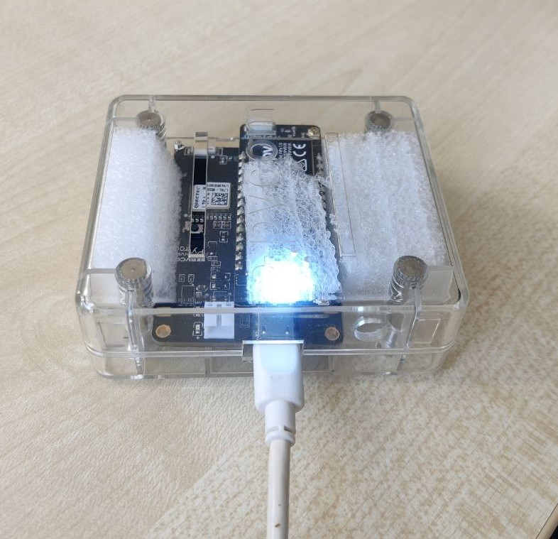

AUTHOR: DAVID TENA GAGO
# GPS Board
The objective of this project is to create a GPS tracker that can sequentially report the GPS location of the device.

The system is intended to work on a FiPy (ESP32 board), mounted on a PySense board, which already has got embedded the GPS antenna.

The code that should be flashed into the FiPy is the contet of the folder ``src/``. The rest should not be uploaded to the board.
    
<br>

## NOTES
There are 2 main files:
- One that uses library ``L76GNSV4`` (recommended). Allows you to also calculate quality of the signal, altitude, etc.
- Other that uses library ``L76GNSS``. It is more basic and it is not better in any way.

Dictionary of colours of the FiPy LED:
- ⚪️ **White**: Acquiring fix (from cold start it may take up to 10 minutes)
- 🟢 **Green**: Location calculated with good signal (HDOP < 2.0)
- 🟠 **Orange**: Location calculated with bad signal (HDOP >= 2.0)
- 🔴 **Red**: Location could not be calculated
- 🟣 **Magenta**: Whatever other unhandled error (sleeps for 1 sec and retries)

## Usage

```python
def gpsLocationThread(debug=True):
	try:
		ser = serial.Serial(port='/dev/ttyACM0', baudrate=115200, parity=serial.PARITY_NONE, stopbits=serial.STOPBITS_ONE, bytesize=serial.EIGHTBITS, timeout=10)
		if debug and ser.is_open:
			print("GPS -> Serial GPS device connected successfully.")
		while 1:
			line = ser.readline()
			if line != b"" and line != b"\n":
				line = line.decode()[:-1]
				try:
					fix, numSat, latitude, longitude, altitude, HDOP = line[:-2].split(",", 5)
				except ValueError:
					continue
````

The sensor reports the information approximately every 1 second with this format:

```python
result {
	fix:int,
	numberOfSV:int,
	latitude:float,
	longitude:float,
	altitude:float,
	HDOP:float
}
```

- fix: whether the GPS is able to calculate the position.
- NumberOfSV: Number of satellites in view. Fix will be set to True if this parameter is at least higher than 4.
- latitude: Latitude
- longitude: Longitude
- altitude: Altitude expressed in meters above sea level
- HDOP: horizontal dilution of precision. It's a measure to calculate the error propagation. The lower, the better.

Links for the libraries in use:
- [L76GNSV4](https://github.com/andrethemac/L76GLNSV4)
- [L76micropyGPS](https://github.com/gregcope/L76micropyGPS)
- [micropyGPS](https://github.com/inmcm/micropyGPS)
