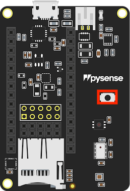

Steps for udpdating Fipy and Pysense firmware. It is important to follow these instructions in order.

1. Flash PySense/PyTrack/Expansion board
2. Flash FiPy

# PySense/PyTrack/Expansion board firmware update
Update the firmware. To do so:
- **IMPORTANT**: Close Atom or any other software that could be using the serial port.
- Navigate to *firmware_update/dfu-utils* and have this command prepared to be run in your terminal (don't run it yet):

```bash
sudo dfu-util -D ../pysense_0.0.8.dfu # (Linux)

dfu-util-static.exe -D ..\pysense_0.0.8.dfu # (Windows)
```

- Unplug the board
- Remove any FiPy, if there is any
- Press and hold the S1/MCLR button on your device (highlighted in red below)
- Plug in the USB cable to the host computer and wait 1 second before releasing the button
- After this you will have approximately 7 seconds to run the command described above

<br>

If everything goes OK, you will have an output like this:
```text
dfu-util 0.9

Copyright 2005-2009 Weston Schmidt, Harald Welte and OpenMoko Inc.
Copyright 2010-2016 Tormod Volden and Stefan Schmidt
This program is Free Software and has ABSOLUTELY NO WARRANTY
Please report bugs to http://sourceforge.net/p/dfu-util/tickets/

Match vendor ID from file: 04d8
Match product ID from file: f014
Opening DFU capable USB device...
ID 04d8:f014
Run-time device DFU version 0100
Claiming USB DFU Runtime Interface...
Determining device status: state = dfuIDLE, status = 0
dfu-util: WARNING: Runtime device already in DFU state ?!?
Claiming USB DFU Interface...
Setting Alternate Setting #0 ...
Determining device status: state = dfuIDLE, status = 0
dfuIDLE, continuing
DFU mode device DFU version 0100
Device returned transfer size 64
Copying data from PC to DFU device
Download    [=========================] 100%        16384 bytes
Download done.
state(2) = dfuIDLE, status(0) = No error condition is present
Done!
```

if not, try again. 🤷‍

If nothing works after several tries, there's a way that works for Windows. For that, use the software [Zadig](https://zadig.akeo.ie/) and repeat the process to update the firmware described above but instead of running the command line, you have to select the driver ```libusbK```. More information can be found [here](https://docs.pycom.io/updatefirmware/expansionboard/).


# Fipy firmware update

**IMPORTANT**: Make sure to update your Pysense/Pytrack/Expansion board accordingly before.

1. Install the Pycom Firmware Updater program. Installable file can be found in *firmware_update/pycom_firmware_updater_1.16.5* (for Windows and Debian/Ubuntu).
2. Make sure to close Atom or any other program that could be using the serial port.
3. Open the program just installed
4. Insert your FiPy into a Pysense/Pytrack/Expansion board up-to-date.
5. Connect your board to the PC via USB.
6. Proceed with the setup. Select options:

You're ready to go.
